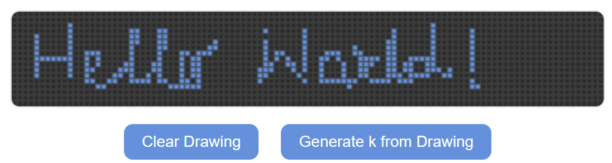

# 🧮 Tupper’s Formula Visualization

> A visual exploration of **Tupper’s Self-Referential Formula** — a mathematical curiosity that can literally plot its own image.

---

## 📖 About

This project brings **Tupper’s formula** to life through an interactive web visualization.  
The formula is famous because when graphed properly, it reproduces its own bitmap — a self-referential mathematical marvel.

You can learn more about it here:  
- [Tupper’s self-referential formula on Wikipedia](https://en.wikipedia.org/wiki/Tupper%27s_self-referential_formula)
- [Original derivation by Jeff Tupper](https://www.dgp.toronto.edu/~tupper/)

---

## 🌐 Live Demo

👉 **Visit the project:** [https://aankitdas.github.io/side-quests/tupper](https://aankitdas.github.io/side-quests/tupper)

*(If the link doesn’t load, make sure the `gh-pages` branch is deployed.)*

---

## 🖼️ Preview

<p align="center">
  
  
</p>


---

## ⚙️ What to Expect

- A clean web visualization of **Tupper’s Formula**, rendered using LaTeX and Markdown.  
- Short explanation of **how the formula encodes an image** in binary form.  
- Future updates will include:
  - Step-by-step explanation of the formula’s logic.
  - Adjustable parameters and visualization scaling.
  - Interactive sliders to explore custom bitmaps.

---

## 🧠 Behind the Scenes

Built with:
- **HTML, CSS, JavaScript** for coding
- **Markdown + LaTeX** for formula rendering  
- **GitHub Pages** for hosting  

---

## 📂 Project Structure

```
├── content/
│ └── side-quests/
│ └── tupper.md # Main post with explanation and formula
├── static/
│ └── demo/ # Place demo screenshots here
├── themes/ # Hugo theme
└── README.md
```


---

## 💬 Future Work

- Add a **stepwise breakdown** of how the bit pattern translates to the plotted image  
- Implement **interactive plotting** (JavaScript or Python backend)  
- Extend to **other self-referential formulas**

---

## 📜 License

This project is released under the [MIT License](LICENSE).

---

### 🧩 “Math is art, and sometimes it draws itself.”
